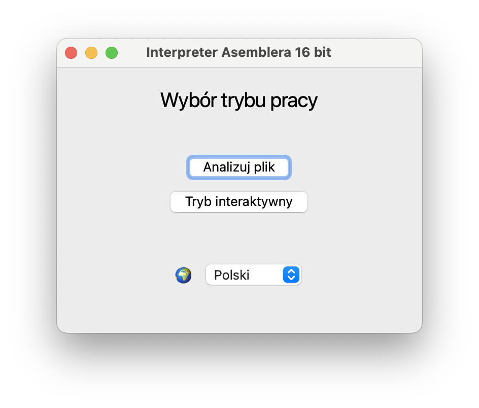
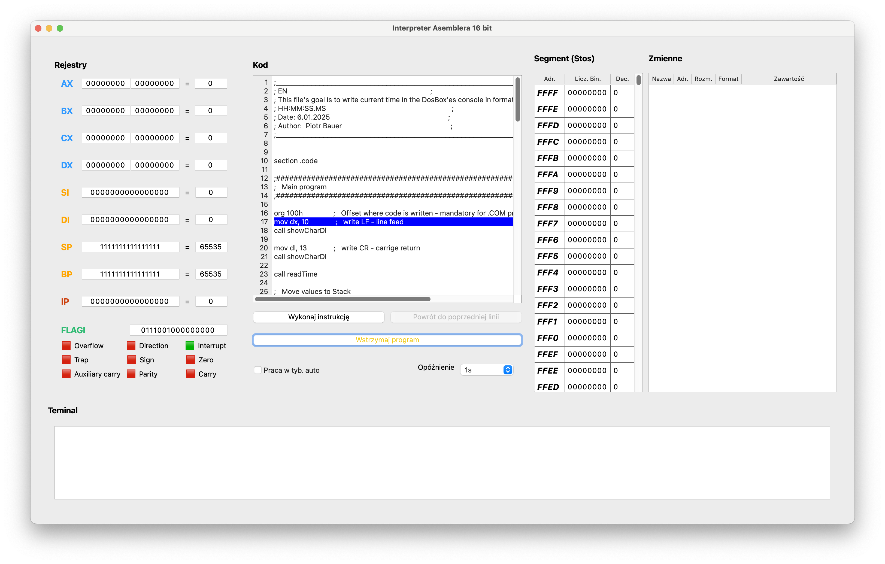
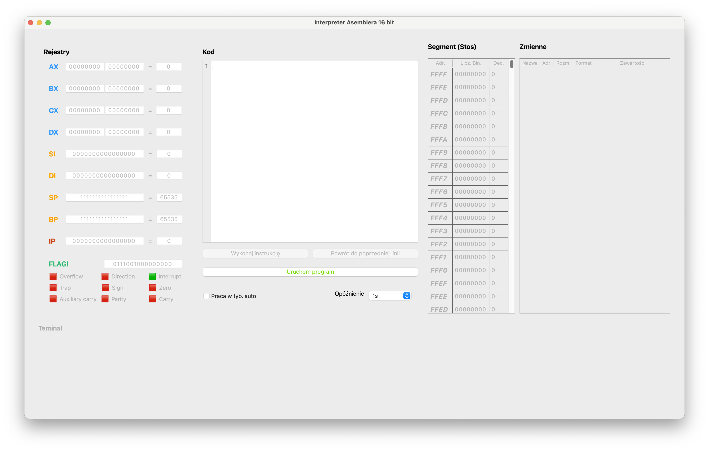

> <b>For English 🇬🇧 scroll down or click [here](#About)</b>

# O projekcie

## Pomysł
Ten projekt jest moją pracą inżynierską dotyczącą napisanego w Pythonie interpretera kodu Asembly 16bit w wersji NASM. Zadaniem programu jest wspomaganie użytkownika w nauce programowania w niskopoziomowym jezyku, Asembly poprzez dostarczenie mu narzędzi napisanych w jezyku wysokopoziomowym umożlilwiające analizę kodu z poziomu GUI i podejrzenie rezultatów w trakcie pracy programu.

## Główne założenia
- Możliwość interpretacij poleceń z gotowego pliku
- Możliwość uruchomienia programu w trybie interaktywny
- Podstawowy interfejs I/O przez symulację namiastki terminala
- Możliwość modyfikacji wartości stanu symulowanych komponentów w trybie interaktywnym
- Możliwość powrotu do stanu sprzed wykonania polecenia
- Możliwość automatycznego wykonywania kolejncyh polceń
- Podstawowe wykrywanie błędów i wyświetlanie potencjalnych źródeł problemu przy raportowaniu


# Przygotowanie do użycia

## Przygotowanie wstępne

Aby skorzystać z programu należy zainstalować wersję interpretera Python 3.10 lub wyższą (projekt testowany był na wersji Python 3.11). 

<details>
   <summary><i><b>Jak sprawdzić, czy poprawnie zainstalowaliśmy środowisko?</b></i></summary>
   <hr>

   Aby upewnić się, że Python został poprawnie zainstalowany, wykonaj następujące kroki w terminalu (cmd, PowerShell, Terminal, Bash – w zależności od systemu):

   1. Otwórz terminal.
   2. Wpisz jedną z poniższych komend:

   ```bash
   python –version
   ```

   lub

   ```bash
   python3 -version
   ```

   Poprawna instalacja powinna zwrócić numer wersji, np. `Python 3.11.8`.

   Jeśli komenda nie zostanie rozpoznana, upewnij się, że:
   - Python został zainstalowany i dodany do zmiennej środowiskowej `PATH`,
   - na niektórych systemach (np. macOS/Linux) domyślnie może być wymagane użycie `python3` zamiast `python`.

   Dodatkowo możesz uruchomić interpreter interaktywny:

   ```bash
   python
   ```

   lub 


   ```bash
   python3
   ```

   Po uruchomieniu powinieneś zobaczyć coś w rodzaju:

   ```bash
   Python 3.11.8 (default, …)
   ```

   Aby wyjść z trybu interaktywnego, wpisz `exit()` lub naciśnij `Ctrl + Z` (Windows) lub `Ctrl + D` (Linux/macOS).

   📚 Oficjalna dokumentacja instalacji Pythona:  
   https://docs.python.org/3/using/index.html

   <hr>
</details>

# Utworzenie środowiska wirtualnego i instalacja bibliotek

Po zainstalowaniu interpretera Python i pobraniu projektu, należy stworzyć środowisko wirtualne dla uruchomienia projektu. Więcej informacji można znaleźć na stronie [dokumentacji](https://docs.python.org/3/library/venv.html) - dla naszego projektu, sprowadzać się będzie to do uruchomienia poleceń w terminalu uruchomionego z poziomu katalogu z repozytorium:

### Dla systemów Linux i MacOS

```bash
python3.11 -m pip install venv
python3.11 -m venv my-venv-folder
source my-venv-folder/bin/activate
python3.11 -m pip install -r requirements.txt
```

### Dla systemu Windows

```cmd
python -m pip install venv
python -m venv my-venv-folder
my-venv-folder\Scripts\activate
python -m pip install -r requirements.txt
```

# Uruchamienie i użycie programu

Uruchomienie i użycie programu (po poprawnej instalacji bibliotek i uruchomieniu środowiska wirtualnego) sprowadza się do uruchomienia programu poleceniem (zakładając iż jesteśmy w katalogu projektu):

```bash
python3.11 main.py
```

Po uruchomieniu, powinniśmy zobaczyć menu główne:

<div align="center">
   
</div>

## Tryby Pracy
### Analizuj plik

W tym trybie zakładamy iż mamy plik, który normalnie kompiluje się, ale nie działa tak jak byśmy oczekiwali. Jeśli spróbujemy uruchomić plik, który zawiera błędy składniowe, zostanie wyświetlony komunikat o błędzie i pojawi się opcja uruchoimenia pliku w trybie interaktywnym.

**Poprawne wczytanie pliku, powinno zakończyć się ruchomieniem interpretera z podglądem kodu:**

<div align="center">
   
</div>

**Aby rozpocząć pracę należy skorzystać z przycisku <span style="color: green">*Uruchom program*</span>:**

<div align="center">
   
</div>

<br>

### Sekcje programu

- **Rejestry i Flagi** - wskazuje wewnętrzy stan symulowanego układu, pozwalając zrozumieć podstawę wykonywanych operacji
-  **Kod** - podgląd pliku / interetowalnego polecenia, wraz z zaznaczoną linią, która zostanie wykonana wciśnięciem przycisku ***Wykonaj instrukcję***
- **Segment** - pokazuje stan stosu procesora (<i><u>dla uproszczenia, stos nie zawiera binarnej reprezentacji wykonywanego programu !</u></i>)
- **Zmienne** - ta sekcja pozwala w łatwy sposób podejrzeć wycinki stosu, w których użytkowni zadeklarował zmienne
- **Terminal** - ta sekcja pozwala na wykonywanie podstawowej komunikacji programu z użytkownikiem przez kilka wybranych poleceń

### Egzekucja poleceń

#### Manualnie

Za pomocą przycisków ***Wykonaj instrukcję*** oraz ***Powrót do poprzedniej linii*** użytkownik zleca wykonanie następnego polecenia, lub przywróceie stanu układu do momentu sprzed wykonania poprzedniego rozaku.

#### Praca w trybie auto

Zaznaczenie tego polecenia spowoduje automatyczneg przechodzenie przez kolejne polecenia (symulowanie naciskania przez użytkownika przycisku ***Wykonaj instrukcję***) w wybranych odstępach czasu oznaczonych jako ***Opóźnienie***.

### Schemat pracy

Po załadowaniu i wstępnym sprawdzeniu pliku, możliwe jest wykonywanie kolejnych polceń a także powrót do stanu sprzed egzekucji polcecenia. Możliwy jest podgląd stanu stosu i rejestrów, co umożliwa prześledzenie zmian i porównanie działania z przewidywanym sposobem wykonania programu. Po zakończeniu programu, konieczne jest ponowne uruchomienie by załadować ponownie kod (np. po wprowadzeniu zmian).

## Tryb interaktywny

Podczas uruchamiania trybu interakywnego zostajemy powitani przez puste okno, gdzie należy wprowadzić kod, który chcemy zasymulować (wyjątkiem jest otworzenie pliku, którego nie udało się uruchomić w trybie Analizy - zawartość pliku jest wtedy wczytana automatycznie):

<div align="center">
   
</div>

Analiza kodu, odbywa się tak samo jak w trybie analizy, z wyjątkiem dwóch kwestii:

1. Możliwa jest zmiana wartości rejestru i stosu bezpośrednio w trakcie pracy programu
2. Po zatrzymaniu egzekucji, możliwe jest dokonywanie zmian w kodzie programu (spowoduje to rozpoczęcie wykonywnaia całego programu od początku)


## Obsługiwane polecenia i ograniczenia

<b><mark>Z uwagi na rozległość tematu jakim jest interpretacja poleceń asemblerowych, wprowadzone zostały pewne ograniczenia natury technicznej i logistycznej do programu ! <u>Oznacza to że nie każdy program, napisany w Asemblerze jest możliwy do uruchomienia i interpretacji !</u></mark></b>

### W skrócie

Ogólna lista obsługiwanych poleceń widoczna jest w sekcji [Układ plików programu](#układ-plików-programu-programs-files-organization), w folderze `Extras/Instructions and descriptions/`. Każde obsługiwane polcenie, zapisane jest jako oddzielny plik `.md`, z nazwą będącą obsługiwanym poleceniem.

### Szczegółowo

Wszystkie szczegóły nt. projektu, ograniczeń, implementacji i filozofii pracy programu można znaleźć w mojej pracy inżynierskiej:

- [Interpreter Asemblera 16bit](./Extras/Instructions%20and%20descriptions/_%20Interpreter%20Asemblera%2016%20bit.pdf) - wersja Polska
- [16bit Assembly Interpreter](./Extras/Instructions%20and%20descriptions/_%20Interpreter%20Asemblera%2016%20bit.pdf) - wersja Angielska (przetłumaczona z pomocą ChatGPT)


<hr style="height:5px;border-width:0;color:gray;background-color:gray">


# About

## General Idea
This project is my engineering thesis which topic is an Assembly 16bit interpreter written in Python language. The goal is to provide user with help in learning low-level language like Assembly by giving tool for analysis and execution of code in high-level language with simple GUI.


## Key features
- Ability to execute assembly file
- Ability to run program in interactive mode
- I/O interface in form of basic terminal
- Ability to introduce changes to the source code during execution (interactive mode)
- Ability to return to simulation state befor execution of instruction
- Ability to automatically execute instructions
- Basic error detection and display of propable sources of errors

# How to run program

## Prerequisits

To use this program, it's necessary to install Python interpreter version 3.10, or highier (project was develope and tested with Python 3.11).

<details>
   <summary><i><b>How to check, if Python was correctly installed?</b></i></summary>
   <hr>

   To ensure, that Pyhon was correctly installed, perform the following steps in terminal (cmd, PowerShell, Terminal, Bash - depending on the system):

   1. Open terminal
   2. Enter one of the following command

   ```bash
   python –version
   ```

   or

   ```bash
   python3 -version
   ```

   If Python was installed correctly, current version should be returned - ex. `Python 3.11.8`.

   If command wouldn'be be recognized, ensure that:
   - Python was installed and added to environemnt variable `PATH`,
   - on some systems (ex. macOS/Linux) by default `python3` should be used, instead of `python`.

   Additionally, you can run interactive mode by typing:

   ```bash
   python
   ```

   or 


   ```bash
   python3
   ```

   After running command you should see something like:

   ```bash
   Python 3.11.8 (default, …)
   ```

   To exit interactive mode, write `exit()` or press `Ctrl + Z` (Windows) or `Ctrl + D` (Linux/macOS).

   📚 Official Python documentation can be found at:
   https://docs.python.org/3/using/index.html

   <hr>
</details>

## Preparation or virtual environment and library instalation

After successfult instalation of Python interpreter and downloading reposity content, it's necessary to prepare virtuall environment and download libraries. More informatios about process can be found on [documentaiton](https://docs.python.org/3/library/venv.html) page - for our project everthing will come down to executing those commands in terminal from repo's folder on our machine:


### For Linux and MacOS systems:

```bash
python3.11 -m pip install venv
python3.11 -m venv my-venv-folder
source my-venv-folder/bin/activate
python3.11 -m pip install -r requirements.txt
```

### For Windows systems:

```cmd
python -m pip install venv
python -m venv my-venv-folder
my-venv-folder\Scripts\activate
python -m pip install -r requirements.txt
```

# Running and Using the Program

Running and using the program (after correctly installing the libraries and activating the virtual environment) boils down to launching the program with the command (assuming we are in the project directory):

```bash
python3.11 main.py
```
After launching, you should see the main menu:

<div align="center">
   
</div>

> Program is available in English, but screenshots depict version in Polish lanuguage

## Working Modes
### Analyze File

In this mode, we assume that we have a file which normally compiles but does not work as expected. If we try to run a file containing syntax errors, an error message will be displayed, and an option to run the file in interactive mode will appear.

**A correct file load should result in starting the interpreter with a code preview:**

<div align="center">
   
</div>

**To start working, use the <span style="color: green">*Run program*</span> button (visible on picture as <span style="color: green">*Uruchom program*</span>):**

<br>

<div align="center">
   
</div>

<br>


### Program Sections

- **Registers and Flags** – shows the internal state of the simulated system, helping to understand the basis of performed operations
- **Code** – preview of the file / interactive command, with the highlighted line that will be executed when pressing the ***Execute Instruction*** button
- **Segment** – displays the state of the processor stack (<i><u>for simplicity, the stack does not contain a binary representation of the executed program!</u></i>)
- **Variables** – this section allows easy viewing of stack fragments where the user declared variables
- **Terminal** – this section enables basic communication between the program and the user through several selected commands

### Instruction execution

#### Manual

Using the ***Execute Instruction*** and ***Return to Previous Line*** buttons, the user commands the execution of the next instruction or restores the system state to the moment before the previous step was executed.

#### Automatic Mode

Checking this option will cause automatic progression through subsequent instructions (simulating the user pressing the ***Execute Instruction*** button) at selected time intervals specified as ***Delay***.

### Operation cycle of program

After loading and initially checking the file, it is possible to execute further commands as well as return to the state before the command was executed. It is possible to view the state of the stack and registers, which allows tracking changes and comparing the behavior with the expected execution of the program. After the program finishes, it is necessary to restart it in order to reload the code (e.g., after making changes).


## Interactive Mode

When starting interactive mode, we are greeted by a blank window where we need to enter the code we want to simulate (the exception is opening a file that could not be run in Analysis mode — in that case, the file’s contents are loaded automatically).

<div align="center">
   
</div>

Code analysis is carried out the same way as in analysis mode, with two exceptions:

1. It is possible to change the values of the registers and the stack directly during program execution.
2. After execution is stopped, it is possible to make changes to the program code (this will cause the entire program to restart from the beginning).


## Supported Commands and Limitations

<b><mark>Due to the complexity of interpreting assembly instructions, certain technical and logistical limitations have been introduced into the program ! <u>This means that not every program written in Assembly can be run or interpreted !</u></mark></b>

#### Summary

The general list of supported commands is visible in the section [Program's files organization](#układ-plików-programu-programs-files-organization), in the folder `Extras/Instructions and descriptions/`. Each supported command is saved as a separate `.md` file named after the supported instruction.

#### Details

All details regarding the project, limitations, implementation, and the program's operating philosophy can be found in my engineering thesis:

- [Interpreter Asemblera 16bit](./Extras/Instructions%20and%20descriptions/_%20Interpreter%20Asemblera%2016%20bit.pdf) - source file (PL)
- [16bit Assembly Interpreter](./Extras/Instructions%20and%20descriptions/_%20Interpreter%20Asemblera%2016%20bit.pdf) - english version (translated from the original using ChatGPT)


<hr style="height:5px;border-width:0;color:gray;background-color:gray">


# Układ plików programu (Program's files organization)

```
Assembly_interpreter
├─ Example assembly programs
│  ├─ incorrect_programs
│  │  ├─ engine_cant_use_sp.asm
│  │  ├─ engine_illegal_operations.s
│  │  ├─ engine_instruction_not_supported_error.asm
│  │  ├─ engine_unrecognized_argument_error.asm
│  │  ├─ engine_wrong_combination_params.asm
│  │  ├─ engine_wrong_param_types.asm
│  │  ├─ proc_file_empty_file_no_white_chars.asm
│  │  ├─ proc_file_empty_file_white_chars.asm
│  │  ├─ proc_file_file_too_big.asm
│  │  ├─ proc_file_improper_var_name.asm
│  │  └─ proc_file_incorrect_file_type.txt
│  ├─ programs_EN
│  │  ├─ convert_calculate_RPN.asm
│  │  └─ show_time.asm
│  ├─ programs_PL
│  │  ├─ obliczanie_ONP_dzialania.asm
│  │  ├─ pokaz_czas.asm
│  │  └─ text_val.asm
│  └─ test_programs
│     ├─ all_vaild_add_instructions.asm
│     ├─ all_valid_flag_setting_instructions.asm
│     ├─ infinite_loop.asm
│     ├─ jumps_and_labels.asm
│     ├─ test_addition_nerar_overflow.asm
│     ├─ test_int21_ax10.asm
│     ├─ test_pushes.asm
│     ├─ test_variable_section.asm
│     └─ working_stack.asm
├─ Extras
│  ├─ Instructions and descriptions
│  │  ├─ AAA.md
│  │  ├─ AAD.md
│  │  ├─ AAM.md
│  │  ├─ AAS.md
│  │  ├─ ADC.md
│  │  ├─ ADD.md
│  │  ├─ AND.md
│  │  ├─ CALL.md
│  │  ├─ CBW.md
│  │  ├─ CLC.md
│  │  ├─ CLD.md
│  │  ├─ CLI.md
│  │  ├─ CMC.md
│  │  ├─ CMP.md
│  │  ├─ CWD.md
│  │  ├─ DAA.md
│  │  ├─ DAS.md
│  │  ├─ DEC.md
│  │  ├─ DIV.md
│  │  ├─ IDIV.md
│  │  ├─ IMUL.md
│  │  ├─ INC.md
│  │  ├─ INT.md
│  │  ├─ JA.md
│  │  ├─ JAE.md
│  │  ├─ JB.md
│  │  ├─ JBE.md
│  │  ├─ JC.md
│  │  ├─ JCXZ.md
│  │  ├─ JE.md
│  │  ├─ JG.md
│  │  ├─ JGE.md
│  │  ├─ JL.md
│  │  ├─ JLE.md
│  │  ├─ JMP.md
│  │  ├─ JNA.md
│  │  ├─ JNAE.md
│  │  ├─ JNB.md
│  │  ├─ JNBE.md
│  │  ├─ JNC.md
│  │  ├─ JNE.md
│  │  ├─ JNG.md
│  │  ├─ JNGE.md
│  │  ├─ JNL.md
│  │  ├─ JNLE.md
│  │  ├─ JNO.md
│  │  ├─ JNP.md
│  │  ├─ JNS.md
│  │  ├─ JNZ.md
│  │  ├─ JO.md
│  │  ├─ JP.md
│  │  ├─ JPE.md
│  │  ├─ JPO.md
│  │  ├─ JS.md
│  │  ├─ JZ.md
│  │  ├─ LOOP.md
│  │  ├─ LOOPE.md
│  │  ├─ LOOPNE.md
│  │  ├─ LOOPNZ.md
│  │  ├─ LOOPZ.md
│  │  ├─ MOV.md
│  │  ├─ MUL.md
│  │  ├─ NEG.md
│  │  ├─ NOP.md
│  │  ├─ NOT.md
│  │  ├─ OR.md
│  │  ├─ POP.md
│  │  ├─ POPA.md
│  │  ├─ POPF.md
│  │  ├─ PUSH.md
│  │  ├─ PUSHA.md
│  │  ├─ PUSHF.md
│  │  ├─ RCL.md
│  │  ├─ RCR.md
│  │  ├─ RET.md
│  │  ├─ ROL.md
│  │  ├─ ROR.md
│  │  ├─ SAL.md
│  │  ├─ SAR.md
│  │  ├─ SBB.md
│  │  ├─ SHL.md
│  │  ├─ SHR.md
│  │  ├─ STC.md
│  │  ├─ STD.md
│  │  ├─ STI.md
│  │  ├─ SUB.md
│  │  ├─ TEST.md
│  │  ├─ XCHG.md
│  │  ├─ XOR.md
│  │  ├─ _ 16 bit Assembly Interpreter.pdf
│  │  └─ _ Interpreter Asemblera 16 bit.pdf
│  └─ Utilities
│     ├─ flag_converter.py
│     └─ show_misspelled.py
├─ README.md
├─ generate_markdow_for_supported_instructions.py
├─ main.py
├─ program_code
│  ├─ __init__.py
│  ├─ assembly_instructions
│  │  ├─ __init__.py
│  │  ├─ arithmetic_instrunctions.py
│  │  ├─ bit_movement_instructions.py
│  │  ├─ data_movement_instructions.py
│  │  ├─ flag_setting_instructions.py
│  │  ├─ flow_control_instructions.py
│  │  ├─ interrupt_instructions.py
│  │  ├─ jump_instructions.py
│  │  ├─ logical_instrunctions.py
│  │  └─ stack_instructions.py
│  ├─ code_handler.py
│  ├─ configs
│  │  ├─ color_palette.json
│  │  └─ names.json
│  ├─ custom_gui_elements.py
│  ├─ custom_message_boxes.py
│  ├─ engine.py
│  ├─ errors.py
│  ├─ flag_register.py
│  ├─ gui.py
│  ├─ hardware_memory.py
│  ├─ hardware_registers.py
│  ├─ helper_functions.py
│  ├─ history.py
│  └─ preprocessor.py
├─ readme_pictures
│  ├─ interactive_mode.png
│  ├─ analiza_pliku.png
│  ├─ ekran_powitalny_gui.png
│  ├─ podpowiedzi.png
│  └─ przyciski sterujące.png
└─ requirements.txt

```
